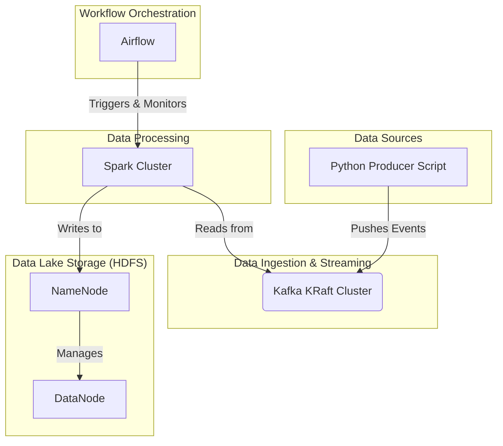

# Modern Data Engineering Stack Practice

This project provides a comprehensive, local development environment for practicing modern data engineering workflows using Docker. It integrates key technologies like Hadoop, Spark, Kafka, and Airflow into a cohesive, ready-to-run stack.

## Architecture

The architecture is designed to simulate a real-world data pipeline, from data ingestion to processing and orchestration.



## Technologies

- **Orchestration**: Apache Airflow `2.9.2`
- **Processing**: Apache Spark `3.5.1`
- **Streaming**: Apache Kafka `3.7.0` (KRaft Mode)
- **Storage**: Apache Hadoop `3.4.0` (HDFS)
- **Database**: PostgreSQL `16`
- **Containerization**: Docker & Docker Compose

## Prerequisites

- [Docker](https://www.docker.com/get-started)
- [Docker Compose](https://docs.docker.com/compose/install/)

## Setup Instructions

1.  **Clone the Repository**
    ```bash
    git clone <your-repo-url>
    cd <your-repo-name>
    ```

2.  **Create Directory Structure**
    Ensure the following directories exist in your project root. They are mounted as volumes into the containers.
    ```bash
    mkdir -p ./dags ./logs ./plugins ./scripts ./config/hadoop
    ```

3.  **Create Hadoop Configuration**
    Create `core-site.xml` and `hdfs-site.xml` inside the `./config/hadoop/` directory as specified in the project documentation.

4.  **Set Up Environment Variables**
    Copy the example `.env` file and customize it.
    ```bash
    cp .env.example .env
    ```
    **Important:** For Linux/macOS users, update `AIRFLOW_UID` in the `.env` file with the output of the `id -u` command to avoid file permission issues.
    ```bash
    echo "AIRFLOW_UID=$(id -u)" >> .env
    ```
5. **Format HDFS NameNode (First Time Only)**
    ```bash
    docker-compose run --rm namenode hdfs namenode -format
    ```
    > **Important:** This step initializes the HDFS filesystem, similar to formatting a new hard drive.
    > This command is mandatory for the first launch but should NOT be run again, as it will erase all HDFS metadata.

## Usage

- **Start all services in the background:**
  ```bash
  docker-compose up -d
  ```

- **Check the status of all services:**
  ```bash
  docker-compose ps
  ```

- **View logs for a specific service (e.g., airflow-webserver):**
  ```bash
  docker-compose logs -f airflow-webserver
  ```

- **Stop and remove all services and volumes:**
  ```bash
  docker-compose down --volumes
  ```

## Service Endpoints

Once the stack is running, you can access the UIs at the following endpoints:

| Service | URL | Credentials |
| :--- | :--- | :--- |
| **Airflow Web UI** | `http://localhost:8081` | `admin` / `admin` |
| **Spark Master UI**| `http://localhost:8080` | N/A |
| **HDFS NameNode UI**| `http://localhost:9870` | N/A |

## Next Steps

1.  Write a Python script in the `./scripts` directory to produce messages to a Kafka topic.
2.  Develop a PySpark application in `./scripts` to process the data from Kafka.
3.  Create an Airflow DAG in the `./dags` directory to orchestrate the entire workflow.